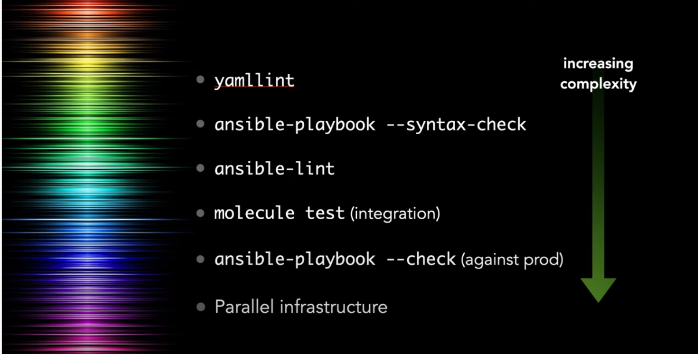

# Episode 7 - Ansible Galaxy, ansible-lint, and Molecule testing

[Ansible 101 - Episode 7 - Ansible Galaxy, ansible-lint, and Molecule testing](https://www.youtube.com/watch?v=FaXVZ60o8L8&t=0s)

[https://ansible.jeffgeerling.com/](https://ansible.jeffgeerling.com/)

## Ansible Galaxy
[THERE'S A ROLE FOR THAT! HOW TO EVALUATE COMMUNITY ROLES FOR YOUR PLAYBOOK](https://www.ansible.com/theres-a-role-for-that)

[geerlingguy.homebrew](https://galaxy.ansible.com/geerlingguy/homebrew)

ansible-galaxy role install geerlingguy.homebrew

*ansible.cfg*
```yaml
[defaults]
nocows = True
roles_path = ./roles
```

*requirements.yml*
```yaml
---
roles:
  - name: elliotweiser.osx-command-line-tools
    version: 2.3.0
  - name: geerlingguy.homebrew
    version: 3.1.0
```

```shell
ansible-galaxy install -r requirements.yml
ansible-playbook main.yml -K
```

## Chapter 13 - Testing and CI for Ansible Content


